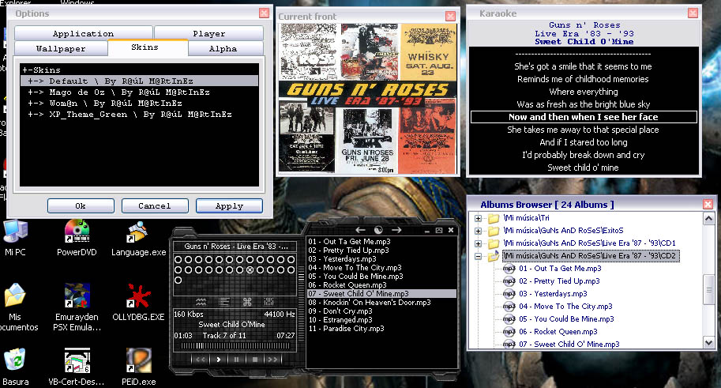



## \[MMPlayerX\]

### Description

Music Mp3 Player X (Updated may-2004). Search, order and play through albums mp3, wma,

wav files and show your cover front. Karaoke function, tag editor, album browser,

cover front browser, Mini Mask mode, skins, languages, xp theme, alpha mode.

Intro, mute, repeat, randomize functions, play list, volume, position controls, and more...

And please vote, I realy wanna know if you like it - to see if there's any reason to keep publishing it...
 
### More Info
 

             |
---                |---
**Submitted On**   |2004-05-24 13:46:06
**By**             |[R@úL M@RtInEz](https://github.com/Planet-Source-Code/PSCIndex/blob/master/ByAuthor/r-l-m-rtinez.md)
**Level**          |Intermediate
**User Rating**    |4.9 (173 globes from 35 users)
**Compatibility**  |VB 5\.0, VB 6\.0
**Category**       |[Sound/MP3](https://github.com/Planet-Source-Code/PSCIndex/blob/master/ByCategory/sound-mp3__1-45.md)
**World**          |[Visual Basic](https://github.com/Planet-Source-Code/PSCIndex/blob/master/ByWorld/visual-basic.md)
**Archive File**   |[\[MMPlayerX1750185252004\.zip](https://github.com/Planet-Source-Code/r-l-m-rtinez-mmplayerx__1-54014/archive/master.zip)

